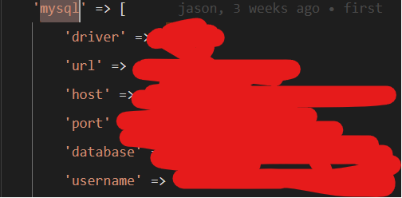

# 打包注意事項
## 請要附上安裝檔案
+---config

+---public

\---env

```
config、env請確認所有敏感資訊。
```
env 修改 email 位置
```
MAIL_MAILER=smtp //預設post方式smtp
MAIL_HOST=host.com 
//ex:package.host.com ->package為host.com子網域
MAIL_PORT=465 //預設465 為smtp 預設port位置
MAIL_USERNAME=
ex:mail@host.com
MAIL_PASSWORD=
MAIL_ENCRYPTION=tls
MAIL_FROM_ADDRESS=
ex:mail@host.com
MAIL_FROM_NAME="${APP_NAME}"
```
env 修改 database
```
DB_CONNECTION=mysql
DB_HOST=local
DB_PORT=sql_port
ex:3307、3308
DB_DATABASE=
DB_USERNAME=
DB_PASSWORD=
```
DB_CONNECTION 請符合config/database變量

driver變量請使用貴公司所使用的sql驅動程式

public 可以更改htaccess 語法符合php 版本

參考:https://hostarmada.com/kb/web-hosting-services/how-can-i-utilize-different-php-versions-in-different-directories-on-hostarmada-shared-hosting-plans
ex:8.1版本
```
   <FilesMatch "\.(php4|php5|php3|php2|php|phtml)$">
    SetHandler application/x-httpd-alt-php81___lsphp
    </FilesMatch>
```

# 圖片symbolic link 建立方式
## 每台主機在移動的時候，建立的絕對位置都不同，因此圖片會有遺失的情形，需要使用終端建立新的圖片絕對位置捷徑
``
請先刪掉public/storage(捷徑)，在施行以下辦法，從storage/app/public建立新捷徑。
``
```
 根目錄執行:php artisan storage:link
```
請確認php環境變量版本正確
